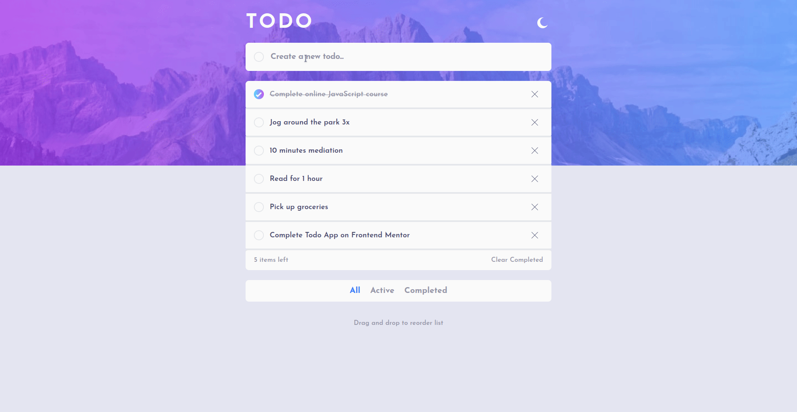
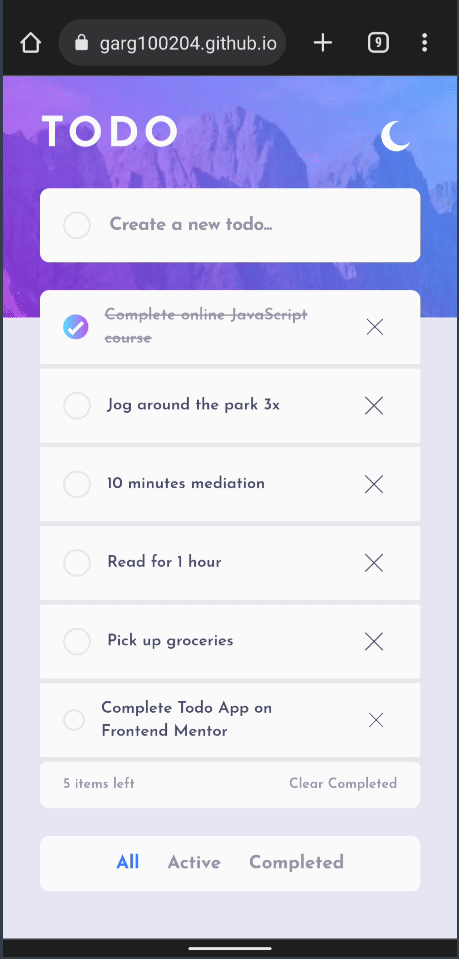

# Frontend Mentor - Todo app solution

This is a solution to the [Todo app challenge on Frontend Mentor](https://www.frontendmentor.io/challenges/todo-app-Su1_KokOW). Frontend Mentor challenges help you improve your coding skills by building realistic projects.

## Table of contents

-   [Frontend Mentor - Todo app solution](#frontend-mentor---todo-app-solution)
    -   [Table of contents](#table-of-contents)
    -   [Overview](#overview)
        -   [The challenge](#the-challenge)
        -   [Screenshot](#screenshot)
            -   [Desktop Design](#desktop-design)
            -   [Mobile Design](#mobile-design)
        -   [Links](#links)
    -   [My process](#my-process)
        -   [Built with](#built-with)
        -   [What I learned](#what-i-learned)
    -   [Author](#author)

## Overview

### The challenge

Users should be able to:

-   View the optimal layout for the app depending on their device's screen size
-   See hover states for all interactive elements on the page
-   Add new todos to the list
-   Mark todos as complete
-   Delete todos from the list
-   Filter by all/active/complete todos
-   Clear all completed todos
-   Toggle light and dark mode
-   **Bonus**: Drag and drop to reorder items on the list

### Screenshot

#### Desktop Design

  

#### Mobile Design

	 

### Links

-   Solution URL: [https://github.com/ujjwalgarg100204/Frontend-Mentors-todo-solution](https://github.com/ujjwalgarg100204/Frontend-Mentors-todo-solution)
-   Live Site URL: [https://ujjwalgarg100204.github.io/Frontend-Mentors-todo-solution/](https://ujjwalgarg100204.github.io/Frontend-Mentors-todo-solution/)

## My process

### Built with

-   Mobile-first workflow
-   [Typescript](https://www.typescriptlang.org/)
-   [React](https://reactjs.org/) - JS library
-   [Vite](https://vitejs.dev/)
-   [Tailwind](https://tailwindcss.com/) - CSS Framework
-   [dnd kit](https://dndkit.com/) - Drag & Drop JS library

### What I learned

During my learning experience, I acquired the knowledge to implement drag and drop functionality using [dnd kit](https://dndkit.com/). It allowed me to seamlessly move and rearrange elements within my application. This feature greatly enhanced the user experience and added a dynamic and interactive element to my project.

## Author

-   Website - [Ujjwal Garg](https://github.com/ujjwalgarg100204)
-   Frontend Mentor - [@ujjwalgarg100204](https://www.frontendmentor.io/profile/ujjwalgarg100204)
-   Instagram - [@ujjwalgarg100204](https://www.instagram.com/ujjwalgarg100204/)
-   Linkedin - [@ujjwalgarg100204](https://www.linkedin.com/in/ujjwal-garg-3a5639243/)
-   Twitter -[@UjwalGarg100204](https://twitter.com/UjwalGarg100204)
